### Number of edges in tree
An edge can be defined as the connection between two nodes. If a tree has N nodes then it will have (N-1) edges. There is only one path from each node to any other node of the tree.
### Height of a Tree
**Height** - number of edges on the longest path from the node to a leaf. A leaf node will have a height of 0
### Depth of a Tree
**Depth** - number of edges from the node to the tree's root node. A root node will have a depth of 0.
- height and depth of a tree is equal
- height and depth of a node is not equal
 
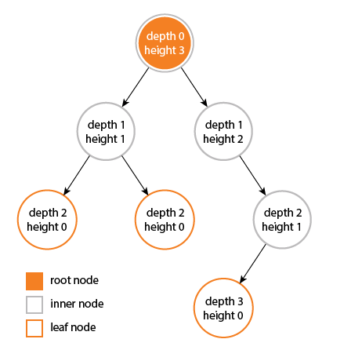

### Degree of a Tree
**Degree** - degree of a node is the number of its children. The degree of a tree is the maximum degree of its nodes.
### Tree Order
**Tree Order** - order of the tree represents the maximum number of children a tree’s node could have. So when we say we have a B-Tree of order N, It means every node of that B-Tree can have a maximum of N children.
 
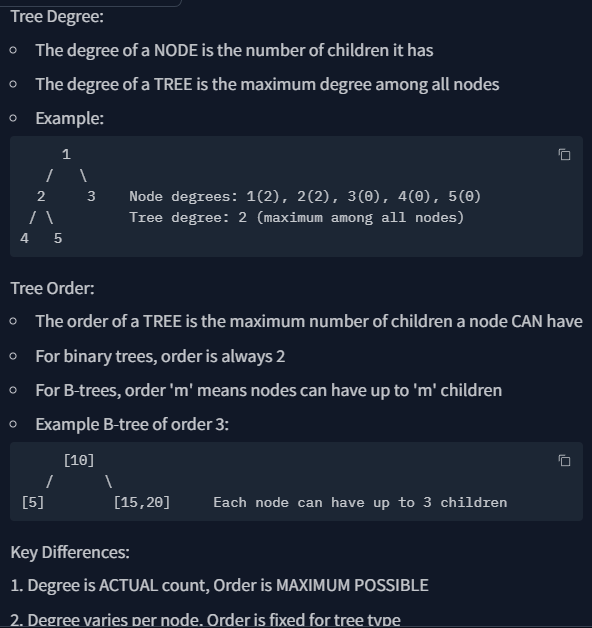
 
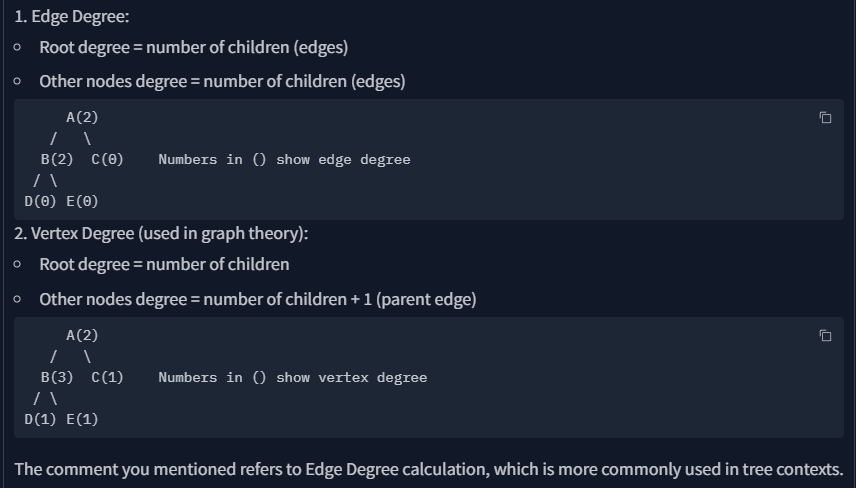
 
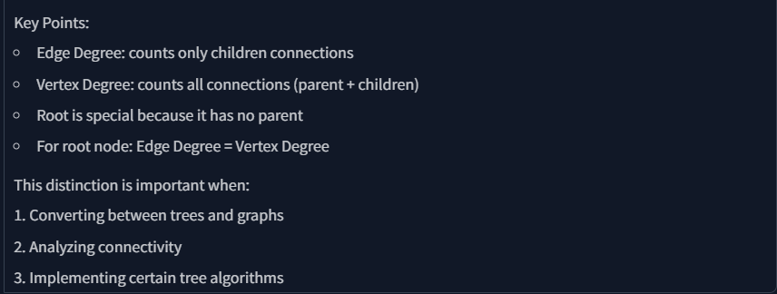

#### Vertex Degree = Edge Degree + 1 (because of parent edge)

## Binary trees can be classified in several ways. Here's a comprehensive breakdown:

### By Nodes per Level:
- Perfect Binary Tree (all levels full)
- Complete Binary Tree (all levels full except last, filled left to right)
- Full/Proper Binary Tree (nodes have 0 or 2 children)
### By Balancing Condition:
- AVL Trees (height difference ≤ 1)
- Red-Black Trees (specific coloring rules)
- B-Trees (balanced m-way search trees)
- Splay Trees (self-adjusting)
### By Purpose/Usage:
- Binary Search Trees (BST) - ordered keys
- Expression Trees - mathematical expressions
- Huffman Trees - data compression
- Trie (Prefix Trees) - string operations
- Heap Trees - priority queues
### By Traversal Method:
- Pre-order
- In-order
- Post-order
- Level-order (BFS)
### By Storage Method:
- Array-based implementation
- Linked representation
- Parent-pointer trees
### By Node Properties:
- Binary (max 2 children)
- N-ary/M-way (multiple children)
- Threaded (special pointers)
- Tagged (extra info in nodes)
### By Direction:
- Rooted (single root)
- Unrooted
- Directed/Undirected

## By Nodes per Level

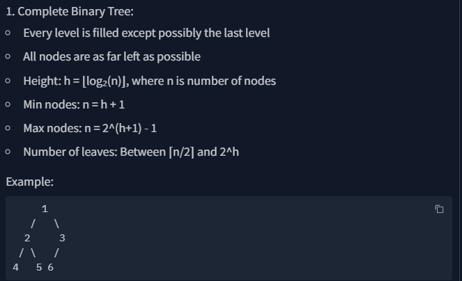

**Height (h) -> h = ⌊log₂(n)⌋** 
 
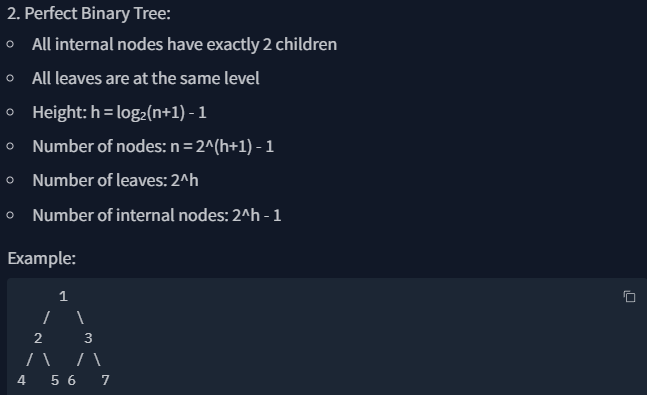

**Height (h) -> h = log₂(n+1)**
 
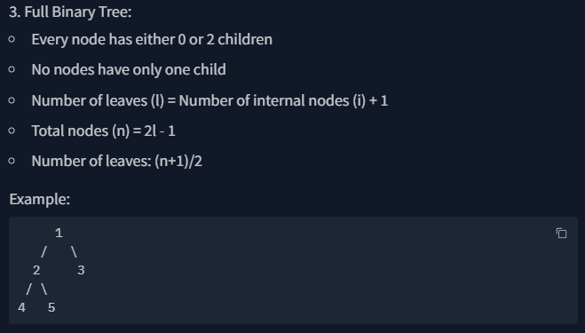
 
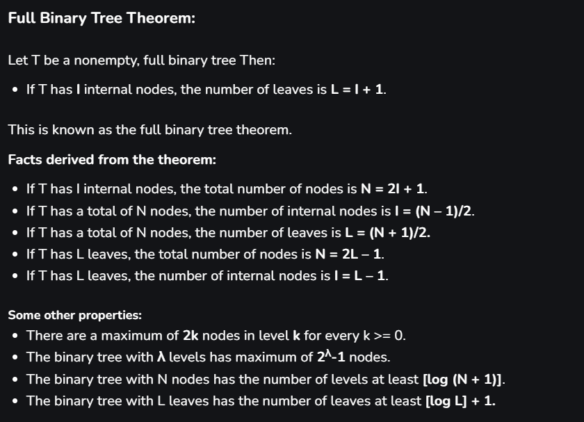
 
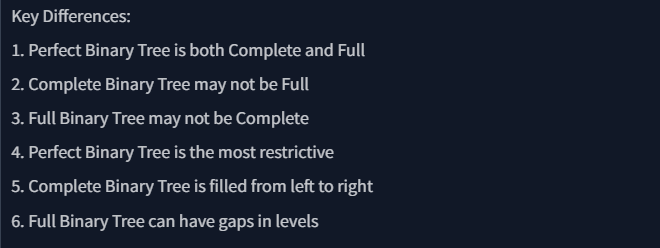
 
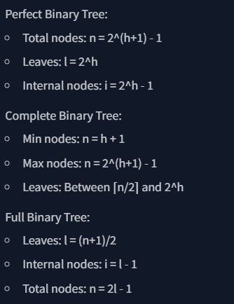

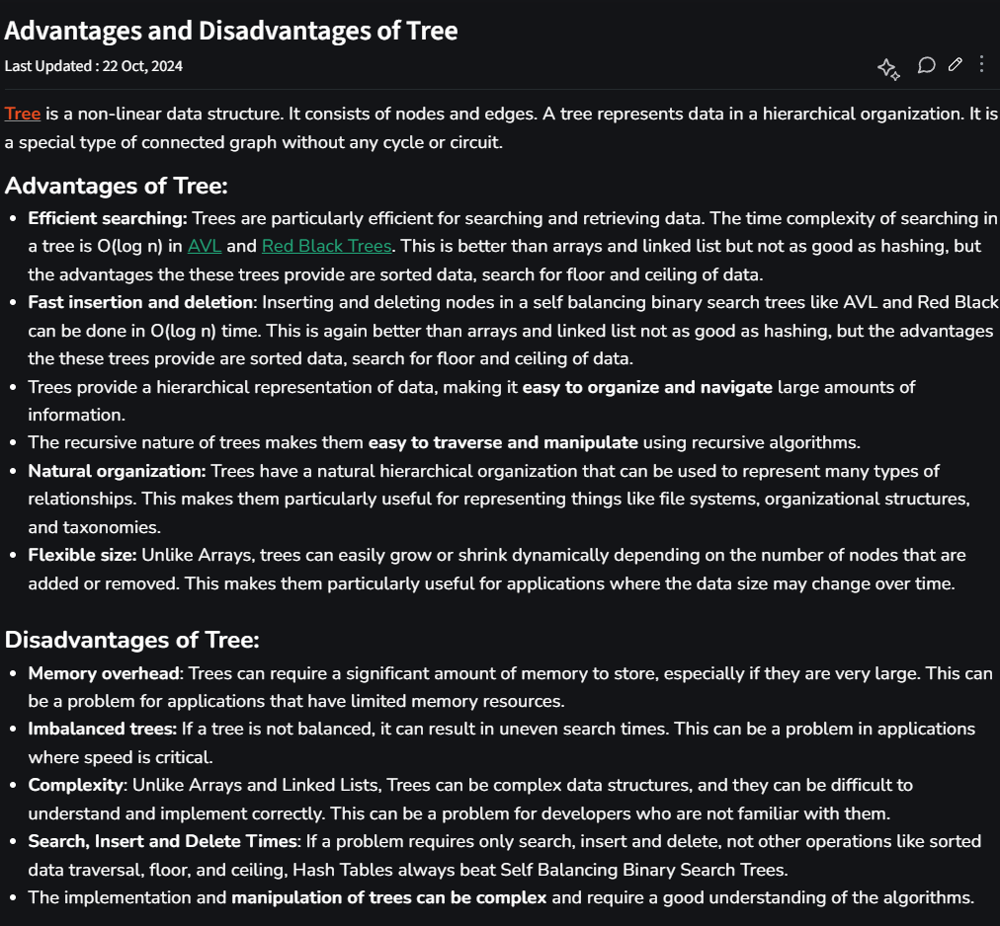